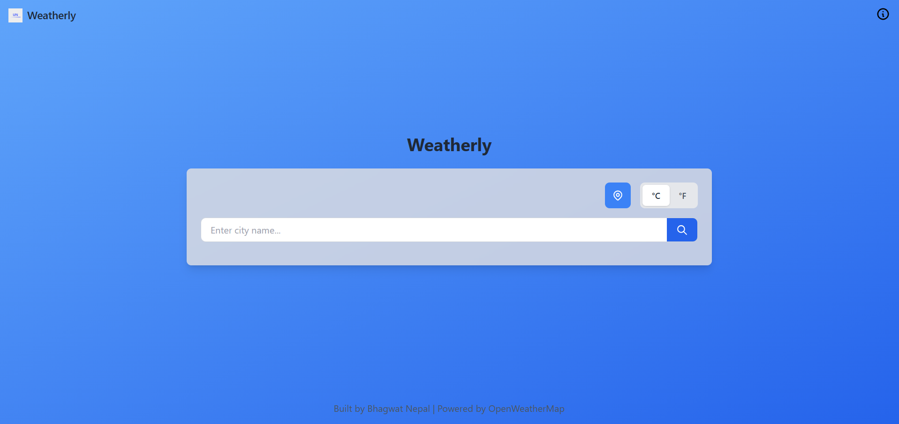
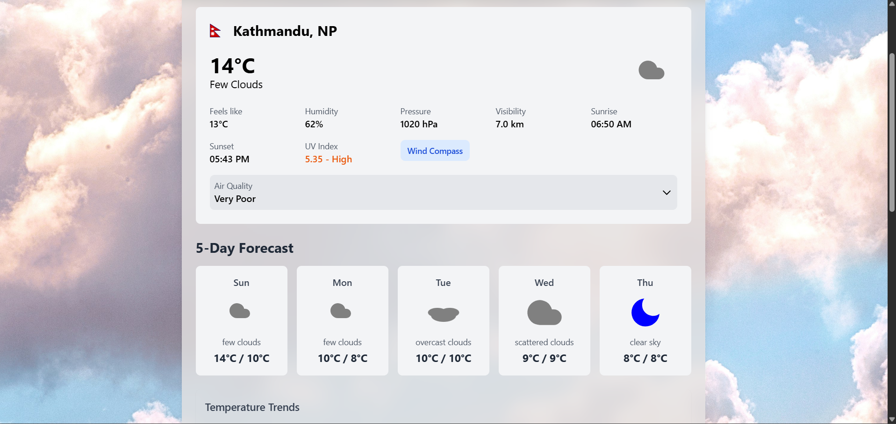

# Weatherly

Real-time weather intelligence app providing comprehensive weather forecasts, air quality insights, and alerts through a clean, responsive interface.

## Screenshots

## Features

- **Real-time Weather Data**: Get current weather conditions including temperature, humidity, wind speed, and visibility.
- **5-Day Forecast**: View detailed weather predictions for the next 5 days.
- **Air Quality Index**: Monitor air quality levels with color-coded indicators.
- **UV Index**: Stay informed about ultraviolet radiation levels.
- **Weather Alerts**: Receive important weather warnings and alerts.
- **Interactive Weather Map**: Visualize weather patterns with an integrated map.
- **Geolocation Support**: Automatically detect and use your current location.
- **Unit Toggle**: Switch between metric and imperial units.
- **Search Functionality**: Search for weather in any city worldwide.
- **Recent Cities**: Quick access to recently searched locations.
- **Responsive Design**: Optimized for desktop and mobile devices.

## Tech Stack

- **Frontend**: React, Vite
- **Styling**: Tailwind CSS
- **Animations**: Framer Motion
- **Maps**: Leaflet, React Leaflet
- **Charts**: Recharts

## Usage

- Enter a city name in the search bar to get weather information.
- Click the location button to use your current location.
- Toggle between Celsius/Fahrenheit using the unit switcher.
- View detailed forecasts, air quality, UV index, and weather alerts.
- Explore the interactive weather map for visual insights.

## Live Demo

[https://ujjwalnepal11.github.io/weather-forecast/]

## API

This app uses the OpenWeatherMap API.

## License

This project is licensed under the MIT License - see the [LICENSE.md](LICENSE.md) file for details.
